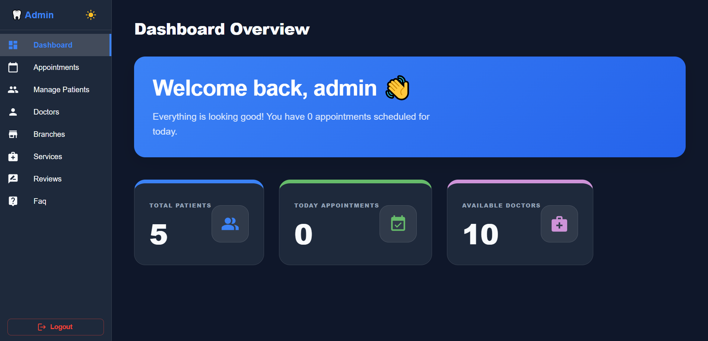
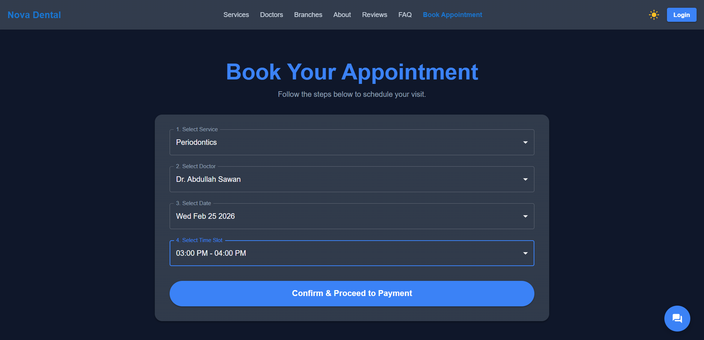

# 🦷 Nova Dental (Dynamic Clinic Management System)

A comprehensive, full-stack Dental Clinic Management System designed to handle everything from patient booking to admin operations. The clinic's branding (like the name "Nova Dental") is completely dynamic and controlled directly from the Admin Dashboard.

## 🔗 Live Demo
**Check out the live application here:** [https://dentistdentalclinic.vercel.app](https://dentistdentalclinic.vercel.app/)

---

## 📸 Sneak Peek

*(Note: Ensure you have your screenshots inside a `screenshots` folder in your repo to view these)*

| Home Page | Admin Dashboard |
| :---: | :---: |
|  |  |
| **Booking & Appointments** | **Responsive Mobile View** |
|  |  |

---

## ✨ Key Features & Killer Architecture

This project was built with a strong focus on **Performance**, **Security**, and **Scalability**.

- **Secure Authentication:** Highly secure flow using JWT short-lived Access Tokens and long-lived Refresh Tokens stored in **HttpOnly, Secure, SameSite cookies**.
- **Admin Dashboard:** Full management of doctors, patients, appointments, and reviews with backend-powered Pagination, Sorting, & Filtering.
- **Route Protection & RBAC:** Strict Role-Based Access Control (Admin, Doctor, Patient) using React Router guards and Express Middleware.
- **Performance Optimized:** Utilizing `React.lazy()`, `React.memo`, and `useMemo` to significantly improve rendering performance and reduce bundle size.
- **React Router v7 Data APIs:** Pre-fetching data parallel to rendering using `Loaders` and `Actions` to avoid loading waterfalls, combined with `Suspense` for non-blocking UI.
- **Appointments & Reviews:** Patients can book appointments securely, doctors can manage their schedules, and users can leave verified reviews.
- **Stripe Payments:** Fully integrated payment gateway with **Stripe Webhooks** (`express.raw`) to securely capture and process asynchronous payment events.
- **Advanced Image Handling:** High-quality, on-the-fly image resizing and optimization using `Multer` & `Sharp`.
- **Email Notifications:** Automated email alerts for appointments and system notifications using `Nodemailer`.
- **AI Integration (Gemini):** Integrated Google Generative AI (Gemini) for intelligent assistance and chat capabilities.
- **Backend Armor:** Protected against common web vulnerabilities using `Helmet` (Headers), `express-rate-limit` (Brute-force protection), `express-mongo-sanitize` (NoSQL Injection), `hpp` (Parameter Pollution), and `sanitize-html` (XSS).

---

## 💻 Tech Stack

**Frontend:**
- React 19 / Vite
- Redux Toolkit (RTK) for State Management
- React Router v7 (Data API `createBrowserRouter`)
- Material-UI (MUI v7)
- Axios (with custom interceptors for automated token refreshing)
- React Markdown

**Backend:**
- Node.js + Express.js
- MongoDB + Mongoose
- JSON Web Tokens (JWT)
- Bcrypt & Bcryptjs (Password Hashing)
- Stripe API
- Multer + Sharp
- Nodemailer (Gmail SMTP)
- @google/generative-ai
- Security & Logging: Helmet, HPP, express-mongo-sanitize, validator, Morgan, Compression, Rate Limiting.

---

## 🧠 Data Flow & State Management

1. **Global State (RTK):** Redux Toolkit is used to manage global states like `Auth`, `Active Branch`, and `User Roles`.
2. **Smart Loaders:** Before a route is rendered, React Router's `loader` checks the Redux store. If data is missing, it dispatches an RTK Thunk to fetch it in the background.
3. **Form Actions:** Using `<Form>` from React Router paired with `action` functions to handle form submissions (Login, Signup, CRUD operations) natively without relying on traditional `onSubmit` handlers.

---

## ⚙️ Environment Variables Explained

To run this project locally, you need to create a `.env` file in your root directories. Here is the explanation of every required variable:

### Backend `.env`

| Variable | Purpose |
| :--- | :--- |
| `PORT` | The port number your backend server will listen on (e.g., 8000). |
| `NODE_ENV` | Environment mode (`development` or `production`). Enables specific logging and error handling. |
| `MONGO_URL` | The connection string for your MongoDB database cluster. |
| `ALLOWED_ORIGINS` | CORS Configuration: The frontend URL allowed to access your API (e.g., your Vercel URL). |
| `JWT_SECRET` | A highly secure secret key used to sign the short-lived Access Token. |
| `JWT_ACCESS_EXPIRES` | Expiration time for the access token (e.g., `15m` for 15 minutes). |
| `JWT_REFRESH_SECRET` | A separate secure key used to sign the long-lived Refresh Token. |
| `JWT_REFRESH_EXPIRES` | Expiration time for the refresh token (e.g., `7d` for 7 days). |
| `GEMINI_API_KEY` | API Key from Google Developer Console to enable the Gemini AI Chatbot feature. |
| `EMAIL_USERNAME` | The email address used by Nodemailer to send automated notifications (e.g., your Gmail). |
| `EMAIL_PASSWORD` | The "App Password" generated from your email provider for SMTP authentication. |
| `EMAIL_HOST` | The SMTP server host address (e.g., `smtp.gmail.com`). |
| `EMAIL_PORT` | The SMTP server port (usually `587` or `465`). |
| `STRIPE_SECRET_KEY` | Your private Stripe API key to process checkout sessions. |
| `STRIPE_WEBHOOK_SECRET` | The endpoint secret to verify that webhook events are genuinely coming from Stripe. |

### Frontend `.env`

| Variable | Purpose |
| :--- | :--- |
| `VITE_API_URL` | The base URL pointing to your deployed backend API (e.g., `https://your-backend.onrender.com/api`). |

---

*Built with ❤️ and countless cups of coffee.*
